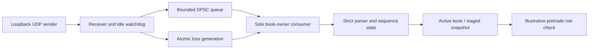

# Market-data transport and recovery lab

A C++20 exercise in feed transport, bounded concurrency, state recovery, risk
gating, and measurement. An actual UDP loopback receiver feeds the order book
from [project 16](../16_cpp_order_book_replay/README.md). A separate lossless
in-memory experiment compares SPSC and mutex queues under identical workloads.

The custom protocol carries **synthetic matching-engine order inputs**. It is
not a decoder for an exchange's L2/L3 feed: real feeds have explicit executions,
modifications, session rules, and recovery protocols that need their own adapter.

## Run

```bash
cmake -S projects/18_market_data_pipeline -B build/pipeline -DCMAKE_BUILD_TYPE=Release
cmake --build build/pipeline --config Release --parallel
ctest --test-dir build/pipeline -C Release --output-on-failure
./build/pipeline/pipeline_demo
./build/pipeline/pipeline_benchmark --events 100000 --repeats 5 > benchmark.csv
python projects/18_market_data_pipeline/summarize.py benchmark.csv
```

Visual Studio executables are under `build/pipeline/Release/` and end in `.exe`.
Linux permits `--producer-cpu 0 --consumer-cpu 2`; both options must be supplied
together, must name available distinct CPUs, and fail visibly if affinity fails.
WSL binds guest virtual CPUs, without guaranteeing physical-core isolation.

## Ownership and failure behavior



- One receiver produces; one consumer owns the parser, both book pointers, and
  all risk decisions. Book iterators never cross thread boundaries.
- The SPSC queue uses acquire/release publication and reuse boundaries, with
  separate 64-byte-aligned index objects. Both implementations have exactly 256
  usable slots in the benchmark. Atomics are not claimed to be lock-free on
  every supported architecture; `std::atomic` supplies the required semantics.
- A full live ingress drops the new datagram and advances a loss generation.
  This signal bypasses the full queue, so even a dropped final packet is seen.
  Queued frames from older generations cannot activate a pre-loss snapshot.
- Wrong lengths, truncated UDP payloads, invalid fields, sequence gaps, stale
  epochs, impossible cancellations, and crossed snapshots invalidate the book.
- Recovery needs `SnapshotBegin` at sequence 1 in a strictly higher epoch,
  zero or more resting orders, and an uninterrupted `SnapshotEnd`. A separate
  `unique_ptr<Book>` stages the snapshot; only the completed snapshot is swapped
  into active ownership. Partial snapshots never replace the diagnostic book.
- The demo checks a 250 ms receiver inactivity deadline on both timeout and
  resumed traffic. Ingress also rejects frames aged 250 ms from host receipt,
  and expires stale consumer state even when the receiver stops entirely.
  The deadline is illustrative and configurable, not an exchange requirement.

The consumer synchronizes loss and receipt age immediately before a risk check.
That check is an observation at that point; a later loss cannot retroactively
invalidate an earlier decision. No order is sent to an exchange. Host receipt
age does not measure exchange timestamp age or network transit delay.

## Wire contract

Every datagram is exactly 48 bytes. Unsigned integers are manually encoded in
big-endian order; no packed-struct casts, native-endian assumptions, or unaligned
loads are used. Positive tick prices must fit a signed 64-bit integer.

| Offset | Width | Field |
|---:|---:|---|
| 0 | 4 | ASCII `MDP1` magic |
| 4 | 1 | Version 1 |
| 5 | 1 | Kind: begin 1, snapshot order 2, end 3, add 4, cancel 5, heartbeat 6 |
| 6 | 1 | Side: none 0, buy 1, sell 2 |
| 7 | 1 | Reserved zero |
| 8 | 8 | Positive sequence |
| 16 | 8 | Positive epoch |
| 24 | 8 | Order ID |
| 32 | 8 | Price in ticks |
| 40 | 8 | Quantity |

Unused fields must be zero; order sides are mandatory only for order messages.
Snapshot begin, end and heartbeat have zero ID/price/quantity. Cancel carries only
an ID. Sequence exhaustion requires recovery, with no wrap to zero. The decoder
rejects noncanonical encodings. The protocol has no authentication and the
provided socket binds only to IPv4 loopback.

## Risk scope

The pure gate checks feed health, a two-sided uncrossed market, positive order
size/price, maximum order size, distance from the exact midpoint, and worst-case
long/short position including supplied outstanding buys and sells. Arithmetic
handles `INT64_MIN`, `INT64_MAX`, and unsigned quantities without overflow.

It does not reserve exposure, submit orders, update fills, enforce credit or
notional limits, or implement an OMS. Repeated individually passing requests do
not establish portfolio-wide enforcement. Benchmark requests use a constant
empty exposure state and never submit orders.

## What is measured

The benchmark preloads 1,024 resting orders at 64 price levels, then processes
100,000 deterministic events: 40% non-crossing additions, 40% cancellations, and
20% heartbeats. Active book depth alternates between 1,024 and 1,025. Every event
is decoded, applied, and followed by the same risk check. This workload does not
measure trade execution or deep sweeps through resting liquidity.

Both queue variants receive an unreported warm-up and five alternating measured
repeats. The nominal benchmark retries a full queue and yields; it loses no
events. This is backpressure, not a UDP overload experiment. Actual UDP and
overflow/recovery paths are verified separately by the demo and tests.

| Measurement | Exact boundary |
|---|---|
| Uninstrumented throughput | Consumer publishes start until final risk check completes; no per-event timestamps |
| Scheduled latency | Intended burst release until parse/book/risk completion, including delayed production and backpressure |
| Accepted-attempt latency | Timestamp immediately before the successful enqueue attempt until completion; includes publication/lock cost |
| Instrumented service | After dequeue until parse/book/risk completion |

Burst sizes are 32 and 256 events per 100 microseconds (nominal 320,000 and
2,560,000 events/second). Scheduled timestamps remain unchanged during retries,
so catch-up delays are visible. Actual achieved rates and retry counts accompany
latency distributions. There is no claim that a nominal schedule was sustained
when achieved rate falls behind it. Every completed event is included.

Clock calls perturb the latency passes. Back-to-back clock costs are recorded,
without subtracting them from observations. Throughput excludes trace generation,
thread creation, snapshot preload, vector allocation, final verification, sorting,
and printing. Timed loops include queue polling/yields and a rare timeout guard.
Sequential final-state equivalence uses the same pipeline; independent matcher
validation is provided by project 16's scan reference.

See [RESULTS.md](RESULTS.md) for actual measurements and all raw repeats.

## Tests and profiling

Release-active tests cover codec round trips and malformed bytes, snapshot and
sequence boundaries, overflow-safe risk arithmetic, FIFO wraparound, 600,000
concurrent payload transfers, actual UDP truncation/timeout/cleanup, terminal
loss, concurrent ingress recovery, consumer age, and idle expiration.

```bash
cmake -S projects/18_market_data_pipeline -B build/pipeline-asan \
  -DCMAKE_BUILD_TYPE=Debug -DPIPELINE_SANITIZER=address
cmake --build build/pipeline-asan --parallel
ctest --test-dir build/pipeline-asan --output-on-failure

cmake -S projects/18_market_data_pipeline -B build/pipeline-tsan \
  -DCMAKE_BUILD_TYPE=Debug -DPIPELINE_SANITIZER=thread
cmake --build build/pipeline-tsan --parallel
ctest --test-dir build/pipeline-tsan --output-on-failure

perf stat -e task-clock,context-switches,cpu-migrations,page-faults \
  ./build/pipeline/pipeline_benchmark --events 100000 --repeats 5
perf record -e cpu-clock -F 199 -g -- ./build/pipeline/pipeline_benchmark
perf report
```

ThreadSanitizer tests use a process-local `setarch -R` wrapper on Linux to avoid
runtime address-layout conflicts. They fail if the environment prohibits that
operation. Address/undefined-behavior sanitizers run separately from TSan.

Useful interview questions: where are the queue's happens-before edges; why can
a terminal drop be dangerous; why must snapshot activation be atomic; what does
receipt age fail to measure; and why can high throughput coexist with poor tail
latency? Try implementing a decoder or explaining a recovery trace unaided.
