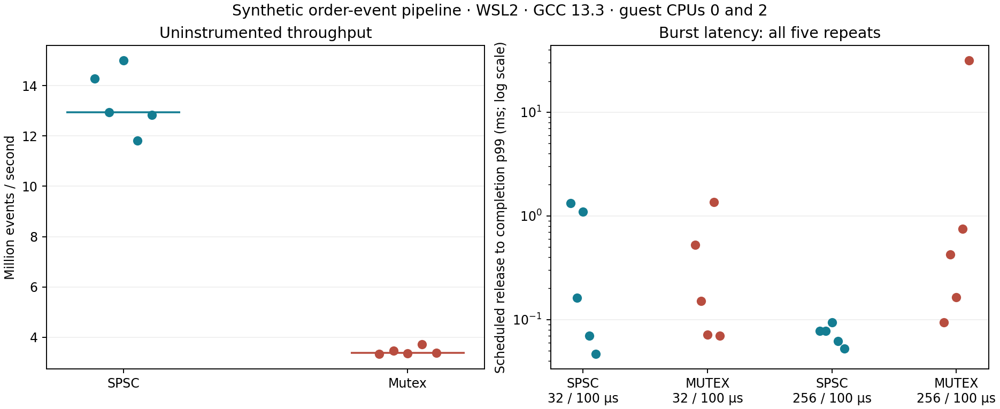

# Recorded pipeline measurements

Measured September 5, 2026 UTC on Ubuntu under WSL2, kernel
`6.18.33.2-microsoft-standard-WSL2`, GCC 13.3.0, CMake Release (`-O3 -DNDEBUG`,
frame pointers retained), Intel Core i5-14400F host. WSL exposes 16 virtual CPUs;
producer and consumer were bound to guest CPUs 0 and 2. No physical-core
isolation, real-time scheduling, or bare-metal performance is claimed.

```bash
./build/pipeline/pipeline_benchmark --events 100000 --repeats 5 \
  --producer-cpu 0 --consumer-cpu 2 > benchmark.csv
python projects/18_market_data_pipeline/summarize.py benchmark.csv \
  --context "Synthetic order-event pipeline · WSL2 · GCC 13.3 · guest CPUs 0 and 2"
```

Full observations: [30 raw rows](measurements/wsl2-gcc13.csv),
[timer calibration](measurements/timer.txt). Each row passed count, sequence,
final-state, invariant and risk-decision checks. Five repeats per variant and
scenario were retained, including scheduling outliers. These are measurements
of synthetic in-process traffic through a bounded queue, parser, book and risk
gate; UDP latency is not included.



| Queue | Throughput median | Range across five repeats |
|---|---:|---:|
| SPSC | 12.94 million events/s | 11.81–15.01 million |
| Mutex | 3.38 million events/s | 3.33–3.71 million |

SPSC improves throughput on this workload. This does not imply every queue,
message mix, CPU layout, operating system or application will show this ratio.

The latency table reports the median of the five per-run p99 values, rather than
a pooled percentile. Range columns expose run-to-run variation.

| Burst / 100 µs | Queue | Scheduled-to-completion p99 median | Per-run p99 range | Accepted-attempt p99 median |
|---:|---|---:|---:|---:|
| 32 | SPSC | 162.49 µs | 46.54–1,331.00 µs | 72.98 µs |
| 32 | Mutex | 151.80 µs | 70.09–1,352.15 µs | 54.24 µs |
| 256 | SPSC | 77.46 µs | 52.75–94.05 µs | 34.77 µs |
| 256 | Mutex | 422.46 µs | 93.80–31,643.69 µs | 113.26 µs |

At the smaller burst, SPSC does not win the median p99 comparison. Shared-host
scheduling and the yield policy create large outliers even at modest offered
load. At the larger burst, one mutex run achieved only 1.44 million events/s
against the nominal 2.56 million; its scheduled delay reached a per-run p99 of
31.64 ms. The lower accepted-attempt delay in that run would conceal much of
that lag if reported alone. Full-queue retry counts are attempts, not distinct
dropped messages; all nominal benchmark messages eventually pass.

Back-to-back `steady_clock` calls measured 16 ns p50, 21 ns p99 and 130 ns maximum
over 10,000 observations. Instrumented service measurements include clock
perturbation. No latency subtraction or sub-clock-resolution claim is made.

## Profiling limits

A separate [software-counter run](measurements/perf-stat.txt) recorded about
8.23 seconds of task CPU time over 3.89 seconds wall time across the entire
benchmark process, including all scenarios and setup. These profiled timings
are not the unprofiled table above. This WSL environment did not expose cycles
or cache-miss counters. Zero reported context switches/migrations with the
user-only event filter are not evidence that scheduling was absent.

An independent [CPU sampling profile](measurements/perf-sampling.txt), with
100,000 events and one repeat per scenario, collected 2,431 samples with zero
lost samples. The largest self shares were `sched_yield` (24.11%), the vDSO clock
routine (17.15%), mutex lock/unlock (6.33% / 5.76%), and final result sorting
(5.39%). It covers the whole process, including setup and sorting; it does not
isolate a timed region or one queue variant. It illustrates polling and timing
overhead, without attributing these percentages to the matching engine.

The profile used `perf record -e cpu-clock -F 199 -g -o /tmp/quant-pipeline-profile.data`.
Writing the recording on the Windows-mounted filesystem failed; native WSL
storage succeeded. Raw recordings are not committed; the text report is.

Cache behavior and allocation effects remain hypotheses until supported by
appropriate hardware-counter or allocation measurements. The project includes
reproducible profiling commands for a suitable Linux host.

## Correctness evidence

The protocol/risk suite runs 14,087 checks including 10,000 random codec round
trips and exhaustive small-state risk comparisons. Queue/UDP tests run 24,045
checks and transfer 600,000 concurrent payloads. Separate ingress tests exercise
loss generations, concurrent overflow/recovery, aged frames, and empty-queue
freshness expiry. The UDP demo injects a sequence gap, a late message, an
oversized valid prefix, and feed silence, then verifies recovery.

GCC and MSVC Release tests, GCC address/undefined-behavior checks, and all five
ThreadSanitizer tests passed
locally. Cross-platform and thread-sanitizer results are also enforced in the
repository workflow. The tests establish the documented educational contract,
not compatibility with a production exchange protocol.
