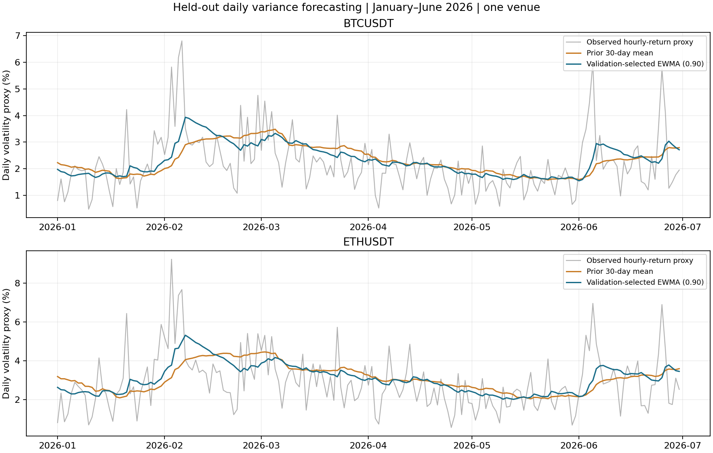

# Recorded real-data forecasting results

Run on **2026-09-05**, using Python 3.13.3, NumPy 2.2.6, and pandas 2.3.3.
The fixed study code, candidates and split were established before inspecting
these held-out model scores. This remains a **retrospective** held-out period,
not a preregistered or prospective experiment. No candidate was added or tuned
after reading these results.

The validation-selected EWMA had lower held-out mean losses than each baseline
for both assets. **The BTC comparison against the 30-day mean remains uncertain:**
its seven-day block-bootstrap interval includes zero. The corresponding ETH
interval lies below zero under the chosen resampling assumptions. Neither
asset has an interval excluding zero against the fixed training-mean baseline.

## Data and scoring coverage

| Quantity | BTCUSDT | ETHUSDT |
|---|---:|---:|
| Verified hourly rows | 22,632 | 22,632 |
| Source calendar days | 943 | 943 |
| Complete daily variance observations | 942 | 942 |
| Complete 2024 training days | 366 | 366 |
| Common 2025 validation days | 365 | 365 |
| Common January–June 2026 test days | 181 | 181 |
| Observed variance days below the numerical floor | 0 | 0 |

All **62** monthly archives passed the data manifest checks. There were no
missing source hours. December 1, 2023 is the only incomplete variance day:
the requested dataset lacks November 30's last hourly close. Each scoring
period uses exactly the same target dates across all compared models.

## Selection using 2025 only

| EWMA lambda | BTC validation QLIKE | ETH validation QLIKE |
|---|---:|---:|
| **0.90 — selected** | **0.419088** | **0.413357** |
| 0.94 | 0.431102 | 0.418210 |
| 0.97 | 0.452387 | 0.422586 |
| 0.99 | 0.500590 | 0.436271 |

The same candidate won independently for both assets. It is the fastest decay
in the predefined grid; this observation was not used to extend the grid on
the existing holdout. Both selected parameters stay at **0.90** throughout
January–June 2026. Forecast state may incorporate completed prior test days.

## Fixed held-out scores

Lower is better. QLIKE is dimensionless; MSE is on squared variance units
when hourly log returns are expressed as fractions rather than percentages.

| Asset | Forecast | Mean QLIKE | MSE |
|---|---|---:|---:|
| BTCUSDT | Selected EWMA | 0.383970 | 4.228007e-7 |
| BTCUSDT | Prior 30-day mean | 0.445709 | 4.582165e-7 |
| BTCUSDT | Previous day | 0.691628 | 4.972964e-7 |
| BTCUSDT | Fixed 2024 training mean | 0.476570 | 4.926498e-7 |
| ETHUSDT | Selected EWMA | 0.399323 | 1.144815e-6 |
| ETHUSDT | Prior 30-day mean | 0.468539 | 1.279552e-6 |
| ETHUSDT | Previous day | 0.702023 | 1.474055e-6 |
| ETHUSDT | Fixed 2024 training mean | 0.462441 | 1.288622e-6 |

## Paired uncertainty

Differences are **EWMA QLIKE minus baseline QLIKE**, using all 181 matched
calendar dates. Negative values favor EWMA. Intervals use 2,000 non-circular
moving-block resamples of seven consecutive days, seed `20260905`.

| Asset | Baseline | Mean difference | 95% interval |
|---|---|---:|---:|
| BTCUSDT | Prior 30-day mean | -0.061739 | [-0.148853, +0.007220] |
| BTCUSDT | Previous day | -0.307659 | [-0.534856, -0.129113] |
| BTCUSDT | Fixed training mean | -0.092600 | [-0.176803, +0.004022] |
| ETHUSDT | Prior 30-day mean | -0.069216 | [-0.140706, -0.006969] |
| ETHUSDT | Previous day | -0.302699 | [-0.466945, -0.138970] |
| ETHUSDT | Fixed training mean | -0.063118 | [-0.145743, +0.018059] |

These intervals are conditional on the selected model and the seven-day block
choice; they do not include parameter-selection uncertainty or multiple-
comparison adjustments. BTC and ETH are not independent replications. The
short, single-venue sample and variance proxy limit generalization. No strategy
returns, transaction-cost-adjusted profits, or market alpha were estimated.

The chart displays square roots of the variance quantities as daily percentages
for readability; selection and all scores above use the variance scale.

## Reproducible evidence

- [Exact validation scores](measurements/validation_scores.csv)
- [Exact held-out metrics](measurements/heldout_metrics.csv)
- [Exact paired comparisons](measurements/paired_comparisons.csv)
- [Run metadata and code/data hashes](measurements/run_metadata.json)
- [Source manifest](manifest.json) and [data validation notes](DATA.md)

The full daily predictions are regenerated into `results/predictions.csv` by
`python projects/19_real_data_volatility/run.py`; archived measurements remain
unchanged by reruns. The study/data/bootstrap portion of the recorded run took
0.54 seconds with the already-downloaded cache; plotting/export completed in
0.82 seconds total. These timings describe this local run, not a performance claim.
